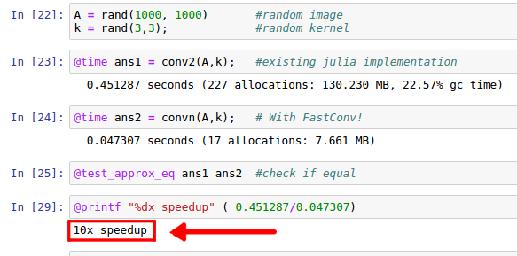

# FastConv.jl
## Fast, Accelerated Convolution Computation in Julia

Link: https://arxiv.org/abs/1612.08825

### Overview
FastConv.jl makes two main contributions for computing convolutions in Julia.

1. Accelerated convolutions for Machine Vision, Machine Learning applications.
2. Scalable implementation of *n-dimensional* convolutions that do not exist in current base Julia software. 

### Background
Base Julia Convolutions are computed in the frequency domain -- yeilding high memory overhead for each use. While this overhead is suitable for applications where the two convolution input signals are very **large**, this package focuses on applications like Machine Vision, and Machine Learning where the input is convolved with a very **small** kernel. Using a direct computation of convolutions we can achieve a significant speedup of computation for these applications.

Furthermore, current versions of Julia (v0.5) support only 1D and 2D convolutions (no support for 3D or even higher dimensions. This package provides implementation of a generic *convn* function which can compute convolutions in any arbitrary dimension.

### Citation:
Paper: [Accelerated Convolutions for Efficient Multi-Scale Time to Contact Computation in Julia](https://arxiv.org/abs/1612.08825)  
https://arxiv.org/abs/1612.08825
> Amini, Alexander, Berthold Horn, and Alan Edelman. "Accelerated Convolutions for Efficient Multi-Scale Time to Contact Computation in Julia." arXiv preprint arXiv:1612.08825 (2016). 

#### Bibtex: 
> @article{amini2016accelerated,  
>    title={Accelerated Convolutions for Efficient Multi-Scale Time to Contact Computation in Julia},  
>    author={Amini, Alexander and Horn, Berthold and Edelman, Alan},  
> journal={arXiv preprint arXiv:1612.08825},  
> year={2016}  
> }
